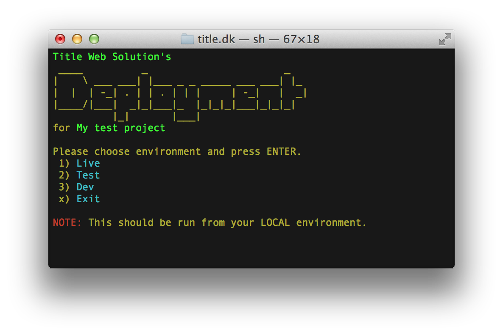
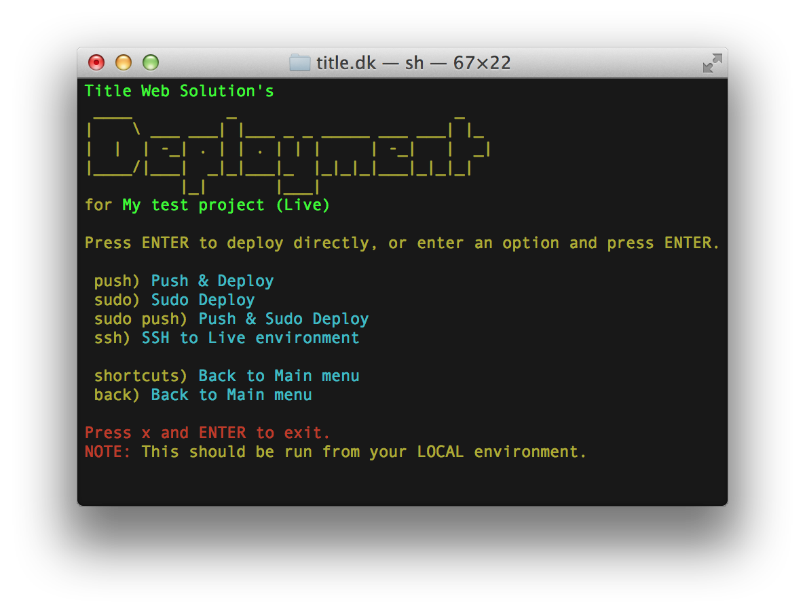

# SilverStripe Deployment

A script-based deployment solution by Title Web Solutions.

Licensed under the MIT license.

_This is opinionated software, so you need to meet some prerequisites.    
These prerequisites fit the way we develop for SilverStripe at Title Web Solutions._

## Philosophy

The idea behind this solution is to simplify things.
This is achieved by keeping all deployment related settings with the code - in the repo.
In a format that is native to SilverStripe - yml.

Furthermore this is targeted at developers that have experience with working with the command line,
as it is entirely command line based. It's easy to use though, and once set up, it should
be accessible to most developers.

## How this works

The solution will be added to your site/app as a git submodule.   
Deployment is done by utilysing a menu on your local development machine, which communicates
with your repo that is checked out on the server. Here all SilverStripe specific tasks are taken care of,
directly on the server, e.g. composer update, db rebuild, and cache clearing. See screenshots.

The installer will guide you through all necessary steps, and set up your first site in the configuration.    
Once installed, you can run the deployment system by typing `./d` in your repository root.

## Installation

Run the following command. This module will be added to your project as a sub module.

	git submodule add git://github.com/titledk/silverstripe-deployment.git deployment;./deployment/_install/local-install.sh;

## Features

See below screenshots for current features.

## Prerequisites

At the moment the system assumes the following

* You're using git
* You're using Composer for managing dependencies
* Your site is inside of a sub directory in your repo (e.g. `public`). There may be ways around this, but this is just how we do it
* You're not adding the libraries managed by Compposer to git - instead you ignore them using `.gitignore` (TODO rewrite this to make it clearer to understand)
* You have Composer and git installed on your server(s)
* You check your solution out with git on your server(s) for deployment
* You have ssh access to your server, and know a little bit about how to configure a web server via the command line    
_This is only needed for setting it up, not for using it_

## Configuration

Configuration is done through the `deployment-config.yml` file which will be placed 
in the root of your repository.

Here is an example of how this looks:

	Projectname: "My test project"
	AvailableEnvironments: "Live, Test, Dev"
	Environments:
	  Live:
		#required
		Host: "myserver.title.dk"
		Sshuser: "myuser"
		Repodir: "/var/git-repos/myrepo"
	
		#additional settings
		Sshport: ""
		Composerdir: "" #not yet implemented - pull requests welcome!
	
	  Test:
		#here goes data for a test server
	  Dev:
		#here goes data for dev server - you can add as many servers as you want

## Roadmap

We're planning the following features:

* Easy setup of post-commit hooks for auto deployment
* Settings on which branch to check out

## Known issues

* The color coding in the installer and menu doesn't work very well on Linux, is only being used at OSX    
_This should be pretty straight forward to amend_

